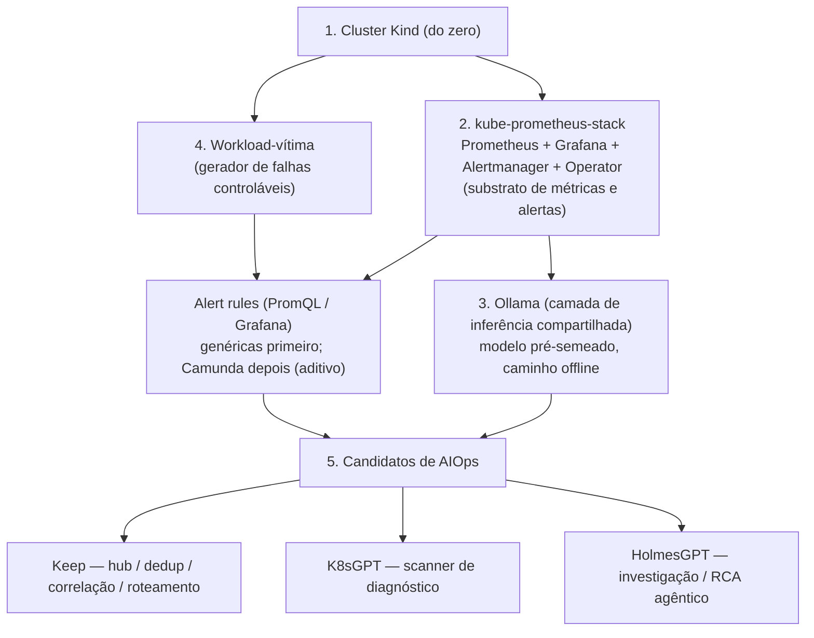

# aiops-lab — Avaliação de AIOps Open-Source para Kubernetes

> Lab reprodutível para avaliar **Keep**, **HolmesGPT** e **K8sGPT** sob as restrições reais de produção (CPU-only, sem egress, custo zero, deploy via Helm) e produzir uma **recomendação de adoção fundamentada em evidência**, demonstrável ao time técnico.

---

## Como reproduzir

**Requisitos de hardware:**

| Recurso | Mínimo (gemma2:2b) | Recomendado (matriz completa) |
|---|---|---|
| vCPUs | **4** | 4 |
| RAM | **8 GB** | 12 GB |
| Disco livre | **15 GB** | 30 GB |

Valores baseados em medição real do cluster (CPU requests: ~1.6 vCPUs · RAM requests: ~3.7 GB · imagens: ~6 GB · modelos Ollama: 1.6 GB por modelo, até 14 GB com todos os 6 da matriz).

> ⚠️ **2 vCPUs não é suficiente.** Com 2 vCPUs o scheduler esgota os CPU requests e os pods do Keep e K8sGPT ficam em `Pending`. Ajuste o hipervisor antes de prosseguir.
>
> ⚠️ **Disco:** cada modelo Ollama adicional ocupa ~1.6–4.4 GB. Reserve espaço extra se for testar a matriz completa de modelos.

**Pré-requisito zero — instale o `git` se ainda não tiver:**

```bash
# Debian / Ubuntu / WSL2
sudo apt-get install -y git

# Fedora / RHEL / CentOS
sudo dnf install -y git

# macOS
xcode-select --install
```

> Windows nativo não é suportado. Use WSL2 com Ubuntu ou Debian:
> `wsl --install -d Ubuntu` (PowerShell como Administrador).

```bash
git clone https://github.com/alisson92/aiops-lab.git && cd aiops-lab

make check        # verifica ferramentas, RAM, disco e portas         (30s)
make setup        # cria cluster + sobe todos os releases + bootstrap (~10 min)
```

> **`make check` apontou que o `helmfile` está faltando?**
> Instale com os comandos abaixo (o release é um `.tar.gz` — não um binário direto):
> ```bash
> HF_VER=$(curl -sf https://api.github.com/repos/helmfile/helmfile/releases/latest | grep '"tag_name"' | sed 's/.*"tag_name":.*"v\([^"]*\)".*/\1/')
> curl -Lo /tmp/helmfile.tar.gz "https://github.com/helmfile/helmfile/releases/download/v${HF_VER}/helmfile_${HF_VER}_linux_amd64.tar.gz"
> tar -xzf /tmp/helmfile.tar.gz -C /tmp helmfile
> sudo install -m 755 /tmp/helmfile /usr/local/bin/helmfile && rm /tmp/helmfile /tmp/helmfile.tar.gz
> ```

```bash

# uso diário — após reiniciar o PC
make pf           # sobe todos os port-forwards e imprime as URLs
```

> `make pf` detecta e imprime o IP real da máquina. Em WSL2/local use `localhost`; em VM use o IP exibido.

| Serviço | URL | Acesso |
|---|---|---|
| Keep frontend | `http://<IP>:3001` | port-forward |
| Keep API | `http://<IP>:8081` | port-forward · header `X-API-KEY: keepappkey` |
| Grafana | `http://<IP>:3000` | NodePort · admin / admin |
| Prometheus | `http://<IP>:9091` | NodePort |

> Resultado esperado: cluster com Prometheus → Grafana → Keep → Ollama (gemma2:2b) operacionais.
> K8sGPT analisando o namespace `aiops-lab` automaticamente a cada ciclo.

```bash
# injetar e reverter uma falha (exemplo)
bash scenarios/02-oomkilled.sh
bash scenarios/02-oomkilled.sh --revert

# encerrar o lab sem destruir dados
docker stop aiops-lab-control-plane

# destruir tudo
make teardown
```

---

## 1. Visão geral

Este projeto **não é** uma POC descartável nem um MVP de produto. É uma **avaliação técnica (bake-off)**: colocar as três ferramentas no mesmo banco de provas, rodar os mesmos cenários de falha, pontuá-las contra critérios definidos *antes* dos testes e sair com uma decisão defensável.

- **Validação:** local, em cluster Kind (WSL2 e Debian nativo).
- **Alvo de implementação:** produção, em Amazon EKS, via Helm.
- **Público da recomendação:** time técnico inteiro.

### Entregáveis

1. **O lab** — reprodutível por qualquer pessoa do time (idealmente um comando).
2. **O catálogo de cenários** — as mesmas falhas controláveis aplicadas a todos os candidatos.
3. **O comparativo + recomendação + roteiro de demo** — evidência versionada, pronta para virar anexo de uma ADR de adoção.

> O sucesso não é "as ferramentas rodaram", e sim **"consigo recomendar X ao time com argumento e mostrar funcionando ao vivo"**.

---

## 2. Motivação (por quê)

- **Dor real:** plantão noturno 12x36, time pequeno, TL apenas em escalonamento crítico. Reduzir fadiga de alerta e MTTR de madrugada, de forma autônoma, é benefício direto.
- **Decisão fundamentada:** antes de propor qualquer ferramenta a um cliente do setor financeiro, é preciso evidência reprodutível e auditável.
- **Demonstrabilidade:** algo que se mostra funcionando, não que se descreve.

---

## 3. Candidatos avaliados

| Ferramenta | Papel no fluxo | Pergunta que responde | Modo de deploy |
|---|---|---|---|
| **Keep** | Hub de alertas / AIOps (ingestão, dedup, correlação por regra, roteamento, workflows) | "Quais alertas importam e o que faço com eles?" | Workloads namespaced (**Tier A**) |
| **HolmesGPT** | Agente de investigação / RCA disparado por alerta (loop agêntico multi-fonte) | "Por que isso quebrou e como corrigir?" | Deployment/CLI namespaced (**Tier A**) ou Operator (**Tier B**) |
| **K8sGPT** | Scanner de diagnóstico do cluster (analyzers nativos de Kubernetes, *single-shot*) | "O que está errado no meu cluster agora?" | CLI/Deployment namespaced (**Tier A**) ou Operator (**Tier B**) |

### Notas de honestidade

- **Keep:** a *correlação por IA* dele é hospedada e paga → **reprovada nos gates**. Avaliamos o **núcleo open-source** (painel único, dedup, correlação por regra, workflows).
- **HolmesGPT:** é agêntico — faz muitas chamadas de LLM com contexto grande por investigação. É justamente o perfil que mais sofre em inferência **CPU-only local**. **Provar se o valor dele sobrevive aos nossos gates é a pergunta-chave do projeto.**

---

## 4. Requisitos eliminatórios (Gates)

São **pass/fail**. Reprova = eliminado. Só quem passa nos quatro entra na pontuação.

1. **Helm-deployável** — preferencialmente como sub-chart *namespaced* dentro de um umbrella chart.
2. **100% local** — sem egress de dados em runtime. Imagens **e pesos de modelo** espelhados para o registry interno (ECR), no mesmo padrão já usado em produção.
3. **CPU-only** — sem GPU.
4. **Custo real = zero** — sem SaaS, sem API paga, sem tier pago. O único "consumo" é compute.

---

## 5. O eixo central do projeto

Todo o projeto gira em torno de **um tradeoff de três pontas**:

```
        qualidade × latência do diagnóstico
                      ▲
                      │
                      │
  tamanho do modelo ◄─┴─► footprint de CPU/RAM
        (tudo sob egress-zero / CPU-only)
```

Modelo maior → melhor RCA, mas estoura CPU/RAM (custo) e latência. Modelo menor → cabe no orçamento, mas pode não diagnosticar bem o suficiente. **Encontrar — ou provar que não existe — um ponto de equilíbrio viável nesse triângulo é o resultado que o projeto entrega.**

---

## 6. Critérios de avaliação (pontuáveis)

Cada critério pontuado de **1 a 5**, multiplicado pelo peso, somado por ferramenta. Aplicado **somente** aos candidatos que passam nos gates.

| Bloco | Critério | Peso | Justificativa do peso |
|---|---|---|---|
| **Eficácia técnica** | Qualidade do RCA (causa apontada = causa injetada?) | Alto | Valor central da ferramenta |
| | Cobertura (% dos cenários em que foi útil) | Médio | Generalização |
| | Tempo até o diagnóstico útil | Médio | Proxy de MTTr |
| | Redução de ruído (dedup/correlação) | Médio | Forte para o Keep |
| | Falso-positivo / alucinação | **Alto** | Plantão solo: ferramenta que mente custa confiança |
| **Aptidão operacional** | Esforço de setup e day-2 | **Alto** | Time pequeno, operação noturna autônoma |
| | **Autonomia de deploy (Tier A vs B)** | **Alto** | Tier A = adotamos sozinhos; Tier B = depende de aprovação do cliente |
| | Footprint (requests/limits) | Médio-alto | Critério econômico: menor footprint = mais barato e escalável |
| | Segurança e auditabilidade (read-only, RBAC, logs) | **Alto** | Cliente do setor financeiro |
| | Maturidade / risco de roadmap | Médio | Sandbox CNCF; aquisição do Keep pela Elastic; OSS vs enterprise |
| | Ajuste ao stack atual | Médio | Prometheus / Grafana / EKS / Teams |

> Os pesos refletem o contexto: **setup/manutenção, falso-positivo, autonomia de deploy e auditabilidade pesam mais que a qualidade bruta do RCA.** Uma ferramenta brilhante mas difícil de manter, que alucina ou que depende de aprovação externa não serve a este cenário.

---

## 7. Arquitetura em camadas (ordem de construção)

A pilha sobe em camadas, cada uma dependendo da anterior:



- A camada **2 (kube-prometheus-stack)** é **pré-requisito**: sem ela não há métricas nem alertas para alimentar as ferramentas.
- O **Ollama** é dependência compartilhada das ferramentas que usam LLM; seu footprint é um **custo compartilhado** entre os candidatos.
- As **alert rules** começam genéricas (cobrindo a vítima) e recebem regras específicas de Camunda apenas na fase aditiva.

---

## 8. Catálogo de cenários

Para validar *ferramenta de AIOps* não é preciso o Camunda — é preciso **falhas controláveis e determinísticas**. Uma "vítima" mínima (um Deployment trivial) é superior ao Camunda para avaliação: as falhas são reprodutíveis, sem a complexidade de Elasticsearch/Keycloak/Postgres/Zeebe, e as ferramentas investigam *sintomas de Kubernetes* — não importa se o pod quebrado é Camunda ou nginx.

| # | Cenário | Como provocar | Sintoma esperado |
|---|---|---|---|
| 1 | **CrashLoopBackOff** | Comando/processo que sai com erro | Restarts crescentes |
| 2 | **OOMKilled** | Limite de memória baixo + carga | OOMKill, restart |
| 3 | **ImagePullBackOff** | Tag de imagem inexistente | Pod não inicia |
| 4 | **Readiness failing** | Readiness probe quebrada | Pod `Running` mas não `Ready` |

> **Camunda está fora do escopo desta avaliação** (ver §11). Uma vez que o pipeline funcione, o Camunda vira **apenas mais uma fonte de alert rules** (PromQL/Grafana de Zeebe), plugada como camada aditiva. O tooling não muda.

---

## 9. Metodologia / Fases

- **Fase 0 — Backend de LLM.** Decidir e montar a camada de inferência local. Pré-semear o modelo (exercitando o caminho offline) e levantar uma **matriz de modelos CPU-viáveis** (latência × qualidade). *Resultado legítimo possível: "nenhum modelo CPU-viável entrega qualidade suficiente".*
- **Fase 1 — Isolado** (read-only): K8sGPT → HolmesGPT → Keep, um de cada vez, para atribuir resultados a cada ferramenta.
- **Fase 2 — Combinações de dois:**
  - **Keep + K8sGPT** — K8sGPT como *fonte*; achados alimentam o Keep (dedup/correlação). Fluxo: K8sGPT → Keep.
  - **Keep + HolmesGPT** — Keep correlaciona e dispara o HolmesGPT para investigar; o RCA volta como enriquecimento do incidente. Fluxo: Keep ↔ HolmesGPT.
- **Fase 3 — Tríade integrada:** K8sGPT varre → Keep consolida/roteia → HolmesGPT investiga os incidentes priorizados.
- **Fase 4 — Pontuação + recomendação + demo:** aplicar a matriz da §6, redigir a recomendação e montar o roteiro de demonstração ao vivo.

---

## 10. Paridade local × produção (ressalvas)

> **Um cluster Kind é um ambiente permissivo que mascara justamente os constraints que definem este projeto.** Localmente você tem internet e é cluster-admin — então coisas que vão falhar em produção "funcionam". A disciplina é **impor as restrições de produção localmente, de propósito.**

| O que fica invisível no Kind | Por quê | Mitigação |
|---|---|---|
| **Egress / mirror** (gates 2 e 4) | Kind tem internet; Ollama puxa o modelo em runtime e tudo sobe liso | Pré-baixar e embutir/montar o modelo; configurar Ollama para **não** puxar em runtime; testar o caminho offline de propósito |
| **CRD / Tier A vs B** | No Kind você é admin; qualquer operator instala sem atrito | Testar o **modo namespaced (Tier A) primeiro**; registrar quem exigiu CRD como **flag Tier B** |
| **Footprint** | CPU/RAM do notebook ≠ nó de produção; latência CPU-only é sensível a hardware | Tratar números locais como **comparação relativa**; o artefato portável é o requests/limits |
| **Storage e rede** | Kind usa local-path; EKS usa EBS CSI / outra StorageClass; LB/Ingress diferem | **Parametrizar** StorageClass e tipo de Service nos values; nunca hardcodar |
| **RBAC** | Local é amplo; produção é namespaced | Escopar o RBAC das ferramentas ao namespace **já no lab** (least privilege) |

---

## 11. Escopo

### Dentro
- Avaliação das três ferramentas sob os quatro gates.
- Inferência **local** (Ollama), CPU-only.
- Deploy via Helm, **namespaced** (Tier A) como caminho-base.
- Cenários genéricos de falha de Kubernetes (§8).

### Fora (por ora)
- **Camunda** — entra depois, como camada aditiva de alert rules.
- **Correlação por IA paga do Keep** — reprovada nos gates.
- **GPU**.
- **Modo Operator como caminho-base** — só se o ganho justificar o pedido de CRD (Tier B).
- **Ações automatizadas de escrita** (ex.: PRs do HolmesGPT) na fase inicial — **read-only first**.

---

## 12. Itens a validar com o cliente

- **Permissão de CRD (Tier B).** O time de sustentação opera apenas no namespace isolado e provavelmente **não tem permissão cluster-admin** para instalar um CRD novo. O cliente tem.
  - **Proposta:** empacotar a stack como um **umbrella chart "combo"** — no espírito do `kube-prometheus-stack` —, de modo que qualquer CRD necessário seja declarado no bundle e **aprovado pelo cliente de uma vez só**, como unidade. É o caminho mais defensável e o que melhor se encaixa em como já operamos.

---

## 13. Pré-requisitos

Consulte a tabela de requisitos de hardware no início deste README e execute `make check` para validação automática do ambiente.

**Ferramentas obrigatórias:** `docker`, `kind`, `kubectl`, `helm`, `helmfile`, `make`, `python3`, `curl`, `pkill`, `git`, `k9s`

**Sistemas operacionais suportados:** Linux (Debian/Ubuntu/WSL2) · macOS · Windows via WSL2

> O `make setup` cuida de puxar o modelo `gemma2:2b` automaticamente no primeiro boot do Ollama. Os demais modelos da Fase 0 podem ser baixados depois via `kubectl exec` no pod do Ollama.

---

## 14. Status

**Bake-off concluído. ADR redigida. Lab reprodutível validado em WSL2 e Debian nativo.**

- [x] Definição e refinamento do projeto (este README)
- [x] Esqueleto do repositório + `CLAUDE.md`
- [x] Camada 1 — Cluster Kind `aiops-lab` (kind v0.30.0 / k8s v1.34.0)
- [x] Camada 2 — kube-prometheus-stack (chart 86.1.0) + alert rules (4 cenários)
- [x] Camada 3 — Ollama (chart 1.57.0, limit 7 GiB) + 6 modelos no PVC
- [x] **Fase 0** — Benchmark de modelos LLM: 4 de 6 aprovados (`gemma2:2b`, `phi3.5:3.8b`, `qwen2.5:3b`, `mistral:7b-instruct-q4_K_M`)
- [x] Camada 4 — workload-vítima + scripts de cenário (4 cenários)
- [x] **Fase 1 — K8sGPT** (k8sgpt-operator 0.2.27 / k8sgpt v0.4.33) — score **3.1/5**
- [x] **Fase 1 — HolmesGPT** — **eliminado** (tool-calling inviável em CPU-only)
- [x] **Fase 1 — Keep** (keephq/keep v0.1.96) — score **3.5/5**
- [x] **Fase 2** — Keep + K8sGPT em conjunto: papéis complementares identificados
- [x] **Fase 3** — pulada (HolmesGPT eliminado)
- [x] **Fase 4** — pontuação + ADR + roteiro de demo
- [x] **Reprodutibilidade** — `make check → make setup → make pf` validado em WSL2 e Debian (4 vCPUs, 11 GB RAM)

| Artefato | Link |
|---|---|
| Progresso detalhado e decisões técnicas | [`PROGRESS.md`](PROGRESS.md) |
| Evidências e scoring por cenário | [`results/scoring-matrix.md`](results/scoring-matrix.md) |
| Decisão de adoção (ADR-001) | [`results/ADR-001-aiops-platform.md`](results/ADR-001-aiops-platform.md) |
| Roteiro de demonstração ao vivo | [`results/demo-roteiro.md`](results/demo-roteiro.md) |

---

## Apêndice — Relação com a ADR

Este README é a **definição do projeto** e o insumo direto de uma futura **ADR de adoção de AIOps**: os gates viram os requisitos não-negociáveis, a matriz da §6 vira o quadro de decisão, e os resultados do lab viram a evidência que sustenta a recomendação.
